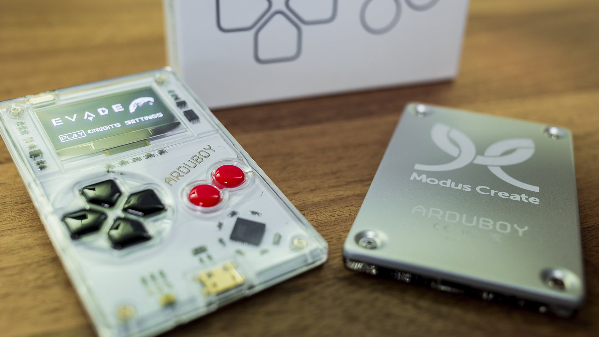
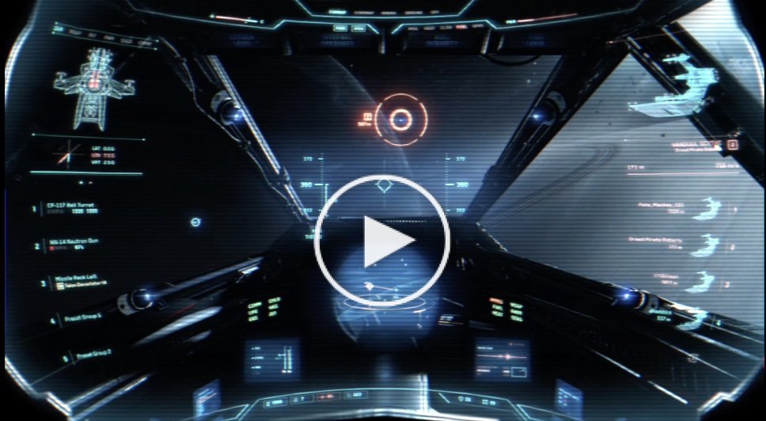

# Evade - A Space Shooter Game for Arduboy by Modus Create

This is an Arduboy game, written as a gift for [Modus Create](http://moduscreate.com) clients for the 2016 holiday season.

Watch the cinematic trailer that we produced for the game on Vimeo:

You can also listen to the music for the first stage of the game on [SoundCloud](https://soundcloud.com/djliquidice/modus-create-arduboy-game-stage1-track).

We also wrote an initial [blog post](http://moduscreate.com/announcing-evade-our-first-arduboy-game/) announcing the release of the game.  More recently, we followed that up with a second post covering some more implementation details.  You can read that [here](http://moduscreate.com/creating-evade-a-side-scrolling-shooter-game-for-arduboy/).

## Quick Start

You will need an Arduboy, which you can get from:

* [Arduboy](https://www.arduboy.com/store/products/arduboy) (different case colors available)
* [Adafruit] (https://www.adafruit.com/products/3264) (white case only)

Arduboy is Arduino based. A program for the Arduino is referred to as a "Sketch".  To install our game on your Arduboy, you will need to get the [Arduino IDE](https://www.arduino.cc/en/Main/Software).

Follow these steps to be able to compile the code:

1. Download the [Arduino IDE](https://www.arduino.cc/en/Main/Software) and install it
2. Start the Arduino IDE
3. Load the `arduboy-game.ino` sketch from the `arduboy/` subdirectory of this project
4. In the Arduino IDE menu, go to "Sketch...Include Library...Manage Libraries" and add the Arduboy library version 1.1.1.
5. In the Arduino IDE menu, go to "Tools...Board" and select either `Arduino Leonardo` or `Arduboy`
6. In the Arduino IDE menu, select to "Sketch...Verify/Compile"

This should compile and verify the Arduino sketch. You should see output in the lower window similar to this:

    Done compiling.

    Sketch uses 28,668 bytes (99%) of program storage space. Maximum is 28,672 bytes.
    Global variables use 1,898 bytes (74%) of dynamic memory, leaving 662 bytes for local variables. Maximum is 2,560 bytes.

When you plug a device into your USB port you need to set the *Port* from the
*Tools* menu.

The *Tick* icon can be used to verify the code prior to uploading. The *Arrow* button uploads the sketch to
the device.  

## .arduboy Distribution

We have also put together a .arduboy distribution for use with game loader tools such as [Arduboy Manager](http://www.crait.net/arduboy/) (Windows only).  

These allow you to load games onto the Arduboy without having to compile them yourself.

The .arduboy archive for Evade is in the `dist` folder in this repo.

## Troubleshooting

If the Arduboy doesn't upload your sketch, try the following procedure:

* Turn off device.
* Press upload, on ide.
* Then hold reset.
* While holding reset press power, then let go of reset.  It will work.

Alternatively:

* Press and -hold- reset button (paperclip)
* Hit upload
* Wait for the “Sketch uses xxx bytes” message
* Count to 4
* Release reset button

Further information on how to unbrick it [here](http://community.arduboy.com/t/how-to-reset-arduboy-if-its-bricked/807).

## Viewing Compiler Output in Arduino IDE

By default the Arduino IDE does not show the output of the compiler as it compiles your code.  If you want to see this:

* Open up Arduino IDE Preferences dialog
* Find the "Show verboase output during" options
* Check the "compilation" check box
* Select "Default" from the "Compiler warnings" drop down
* Click "OK" to save your changes

## Image Conversion

We used [this tool](https://github.com/yyyc514/img2ard) to convert images.  It has its own documentation.

## JavaScript Tool for Converting Strings to Bitmap Font Representations

We created a small JavaScript tool (`tools/text_generator.js` in this repo) to convert arrays of strings into arrays of integers representing the characters in the bitmap font that we use.  This can be run directly in [JS Fiddle](https://jsfiddle.net/).

## Resources

* Start learning with the [Arduboy Quick Start](http://community.arduboy.com/t/arduboy-quick-start-guide/725)
* [Arduboy Library](https://github.com/Arduboy/Arduboy/tree/master/src) - not much for documentation but reading the source shows what it does
* [Some documentation for Arduboy Library](https://asmcbain.net/projects/arduboy/docs/1.2/api/index.html#arduboy)
* [Image Encoding Utility](http://www.andrewlowndes.co.uk/blog/graphics/arduboy-image-converter) - we didn't use this one in the end
* [Reset Procedure if you brick device](https://www.youtube.com/watch?v=l1ifTSq0VK4)
* [Information about Memory](https://www.arduino.cc/en/Tutorial/Memory) we are space constrained and need to pay attention to this
* [Information on use of PROGMEM](https://www.arduino.cc/en/Reference/PROGMEM)
* [Taking Screen Shots of your Arduboy Game](http://community.arduboy.com/t/screen-mirroring-guide-how-to-screenshot-your-game/2800) (requires small code change)

## Legal

Copyright (C) 2016 Modus Create Inc.

This code is [MIT Licensed](LICENSE.txt).
